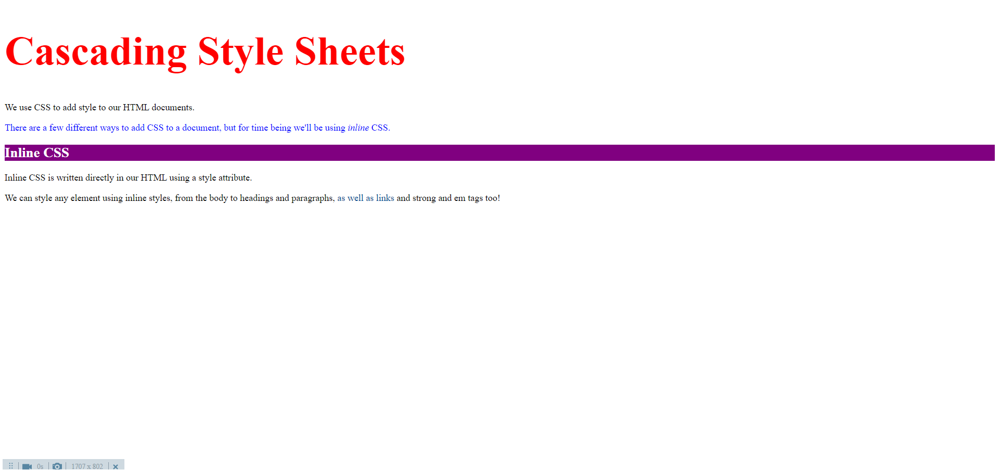

# Day 1

#Today's Learning

- CSS is written in property : value pairs
- They are always separated by colons `:`
- The value is always followed by a semicolon `;`
- We can write CSS inside a style attribute

