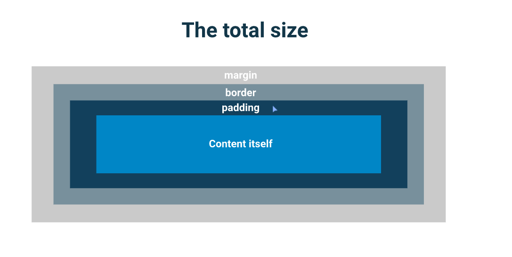

# Day 4

## **Today Learning**

1. Internal CSS
2. External CSS
3. id vs class
4. Box Model
   - margin
   - padding
   - border

### Internal CSS

We can use an internal style sheet that is placed in the head
of our pages

```css
<head>
<style>
CSS goes here
2/style>
</head>
```

Rule:
Made up of a selector, and property: value declarations

```jsx
body {
color: #323232;
}
```

### External css

One file controls ALL the styles, not the page you are on. If you delete something from the style sheet, or change
something, it is changing for all the pages.

### id vs class

Two important differences between IDs and classes

- An iD can only be used on time per page
- A class can be used over and over again

- ID will overwrite a class if they are both selecting the same
  thing

### Box model

Most elements are “block level” elements by default

- They have a width of 100% of their parent
- They have a height of 0

- The height grows to match the content

- They stack one on top of the other

### Margins

Margins are used to control the position of an element relative
to those around it

    margin-left
    margin-right
    margin-top
    margin-bottom

We also have a shorthand margin property

    margin: 10px 20px 30px 40px

    top right bottom left

### Padding

Padding is used to control the positioning of content inside our
element

It works just like margin in terms of the long form and
shorthand properties

> Margin adds empty space to the outside
> Padding adds empty space to the inside

> Margin = empty space

> Padding = more background

### Border

Borders add a border around your element. They are similar to
a stroke if you are used to vector software.

It takes three properties to set a border

    border-width
    border-style
    border-color

You can also control the border of the different sides
independently

```
.example {
border-left: 2px solid pink;,
border-right: 5px dotted red;
border-bottom: 1@px double green;
border-top: 1px dashed purple;

}
```

The total width and height of an element is calculated by
adding all the different parts of the element together

The four parts of an element

- The content itself (what you set the width & height on)
- The padding

- The border

- The margin



### **Centering and element on the page**

Margins accept a set width, but you can also use the auto
keyword.

Auto will automatically place all the available space on that
side.
If we use auto on both the left and the right, it will center the
element on the page.

## Project

[ Project Instructions](./project/README.md)


