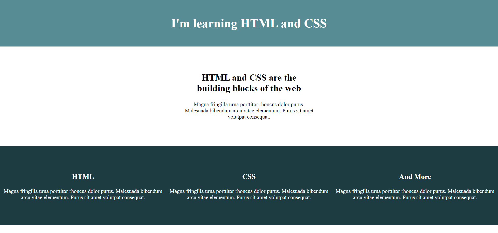
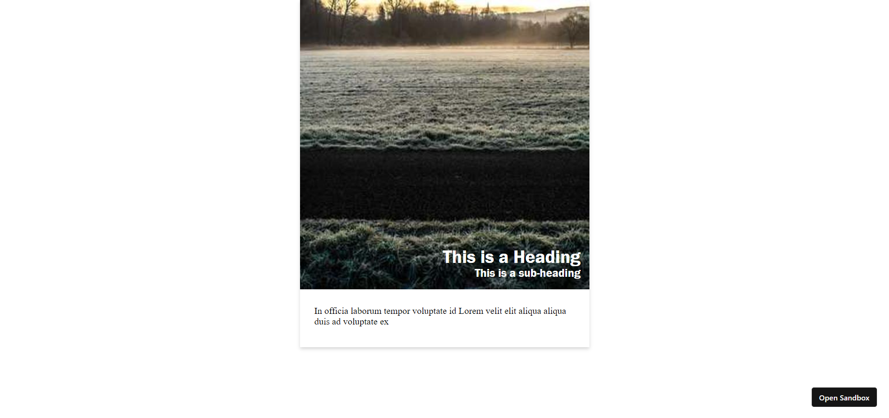

# 21 Days Css

css for 3 weeks

## Day 1

[Day 1](https://github.com/arpit0498/21DaysCss/tree/main/Day01)

project:

[Project Link](./Day01/index.html)

[Github Link](https://github.com/arpit0498/21DaysCss)

## Day 2

[Day 2](https://github.com/arpit0498/21DaysCss/tree/main/Day02)

Created Blog on `Color schemes CSS`

[Click Here for blog](https://arpit-gupta.hashnode.dev/css-color-schemes)

[Project Link](./Day02/project_day02/)

[Github Link](https://github.com/arpit0498/21DaysCss)

## Day 3

[Day 3](https://github.com/arpit0498/21DaysCss/tree/main/Day03)

### Today's Learning

- List
- image
- CSS selectors
- CSS specificity

## Resources:

[Basic Syntax](https://developer.mozilla.org/en-US/docs/Web/CSS/Reference)

[Selectors](https://developer.mozilla.org/en-US/docs/Web/CSS/Reference#selectors)

[Selector different representations](https://www.w3.org/TR/selectors/#overview)

[Project Link](./Day03/)

[Github Link](https://github.com/arpit0498/21DaysCss)

## Day 4

[Day 4](https://github.com/arpit0498/21DaysCss/tree/main/Day04)

### Today Learning

1. Internal CSS
2. External CSS
3. id vs class
4. Box Model
   - margin
   - padding
   - border

## Project

[Project Link](./Day04/project/)

[Github Link](./Day04/)

## Day 5

[Day 5](https://github.com/arpit0498/21DaysCss/tree/main/Day05)

[Github repo Link](https://github.com/arpit0498/21DaysCss)

### **Today Learning**

- Flexbox
- Building layout
- media queries for responsive layout

1. **responsive navigation**
   

   [codesandbox Link](https://codesandbox.io/s/responsive-nav-using-flex-cz4zus)

   [Github Link](./Day05/project/nav_bar/)

2. **flex website**
   

   [Github Link](./Day05/project/flex_website/)

## Day 6

[Day 6](https://github.com/arpit0498/21DaysCss/tree/main/Day06)

### **Today Learning**

- Css mesurements

  - Absolute
  - Relative

    [Click here for measurement units](./Day06/CSS_measurements.md)

- Flex Image Gallery
- Completed Half of blog on Flexbox

## Project

1. **Image Gallery using Flex**
   

   Image will automatically adapt its width and height according to the screen size.

   [Github Link](https://github.com/arpit0498/21DaysCss/tree/main/Day06)

   [website](./Day06/project/imagr-grid/)

## Day 7

[Day 7](https://github.com/arpit0498/21DaysCss/tree/main/Day07)

### **Today Learning**

- CSS Grid

  - Responsive Grids
  - template areas
  - Fraction units
  - Auto-fit minmax

- writing blog on flexbox(completed)
  [Blog Link Flexbox](https://arpit-gupta.hashnode.dev/flexbox-and-its-common-properties)

## Project

CSS Grid

[git code](https://github.com/arpit0498/21DaysCss/tree/main/Day07)

[codepen Link](https://codepen.io/arpit0498-the-vuer/pen/LYgjjGQ)

## Day 8

[Day 8](https://github.com/arpit0498/21DaysCss/tree/main/Day08)

### **Today Learning**

- CSS Grid template layout using[Article Grid layout]
- CSS styling for data fetch

[dataFetch](https://r5w5ch.csb.app/)

## Project

**Article Grid**

<!--  -->

[project](./Day08/project/article/)

[gitcode](https://github.com/arpit0498/21DaysCss/tree/main/Day08)

## Day 9

[Day 9](https://github.com/arpit0498/21DaysCss/tree/main/Day09)

### **Today Learning**

- CSS variables
- Simple Google design page

## Project

Google

[Github code](./Day09/Project/)

[Google Codepen Link](https://codepen.io/arpit0498-the-vuer/pen/BaqwjBv)

## Day 10

[Day 10](./Day10/)

### **Today Learning**

- CSS cards

## Project

Google

<!-- [Project ](./Project/) -->

[Card 1](https://y6e5ez.csb.app/)

[Card 2](https://bi51rt.csb.app/)

[Card 3](https://k6k9h7.csb.app/)

[Github Repo Link](https://github.com/arpit0498/21DaysCss/tree/main/Day10)

## Day 11

[Day 11](./Day11/)

### **Today Learning**

1. CSS math functions
2. css gradients
3. css text shadow

[Github Repo Link](https://github.com/arpit0498/21DaysCss/tree/main/Day11)

## Day 12

[Day 12](./Day12/)

### **Today Learning**

**project** : tabs

[Website](https://rrf8tr.csb.app/)

[Github link](https://github.com/arpit0498/21DaysCss/tree/main/Day12)

## Day 13

[Day 13](./Day13/)

### **Today Learning**

- CSS 3d transforms

        rotateX()
        rotateY()
        rotateZ()

- CSS transform properties
- CSS transform methods
- CSS transition

## Day 14

[Day 14](./Day14/)

### **Today Learning**

- CSS 3d transforms

        rotateX()
        rotateY()
        rotateZ()

- CSS transform properties
- CSS transform methods
- CSS transition

## Day 15

[Day 15](./Day15/)

### **Today Learning**

- css transitions
- css animations
- keyframes
- css bezier

**project**

[codepen](https://codepen.io/arpit0498-the-vuer/pen/GRYQywQ)

[loading_project.webm](https://user-images.githubusercontent.com/32380690/236706505-3f7847ee-30d0-4b30-b49f-b9f999a94866.webm)

[Live preview](./Day15/project/)

## Day 16

[Day 16](./Day16/)

### **Today Learning**

- CSS cards
- CSS animatable properties

# Day 17

[day 17](./Day17/)

### Project

Animated Shoe description-price card

[project](./Day17/Project/card-shoe/index.html)

[day17.webm](https://github.com/arpit0498/21DaysCss/assets/32380690/ecba374b-5fc9-4908-bb09-a50e8ce468d3)

# Day 18

[day a8](./Day18/)

### Project

[Project](./Day18/project/3d_description_card/)

[day18.webm](https://github.com/arpit0498/21DaysCss/assets/32380690/75776417-1ab7-4ec5-b822-29fb4e9b1c59)

# Day 20

[Day 20](./Day20/)

## 3d navigation lander page

[day20.webm](https://github.com/arpit0498/21DaysCss/assets/32380690/4591cba2-aeb5-4484-a69d-def61885633f)

[day 20](./Day20/Project/)
